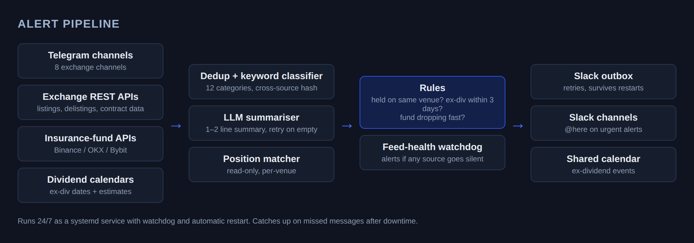
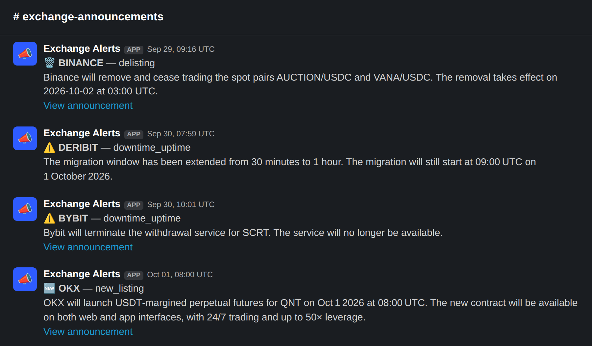

# Risk Alert Pipelines

A service that runs 24/7, reads exchange announcements and risk data, and posts the alerts that matter to the desk's Slack. It covers exchange announcements, ex-dividend funding, and insurance fund / ADL risk.

## Exchange announcements

Reads 8 exchange Telegram channels plus REST feeds from Binance, OKX, Bybit, Deribit and Hyperliquid. Duplicates across sources are dropped, each post is tagged with one of 12 categories (listings, delistings, downtime, API changes, tick size, dividends and so on), and an LLM writes a one or two line summary.

Delistings are checked against our live positions. If we hold the asset on that venue the alert is red, if we hold it somewhere else it's amber, and a reminder goes out an hour before the deadline.

Real posts from the channel. These are public exchange announcements.

## Ex-dividend funding

Equity perps charge a special funding payment on the ex-dividend date, and shorts pay it. The service warns 3 days ahead for anything we hold, works out which legs pay and the exact charge time on each venue, repeats the alert until the position is closed, and adds the event to a shared calendar. It handles US, HK, KR and CN market calendars and holidays, and estimates dividends that haven't been declared yet from past payments.

## Insurance fund and ADL

Tracks insurance fund balances on Binance, OKX and Bybit and alerts when a pool drops quickly, since that usually comes before auto-deleveraging. It also sends a daily summary.

## Reliability

- Runs under systemd with a watchdog and auto restart, and catches up on messages missed while it was down
- Slack messages go through an outbox with retries, so nothing is lost if Slack or the network drops
- Alerts if any source goes quiet. Tested by running it offline for 36 minutes
- Tests use real captured messages and API responses

Code is proprietary. More of my work: [work-portfolio](https://github.com/mjaun556-svg/work-portfolio)
